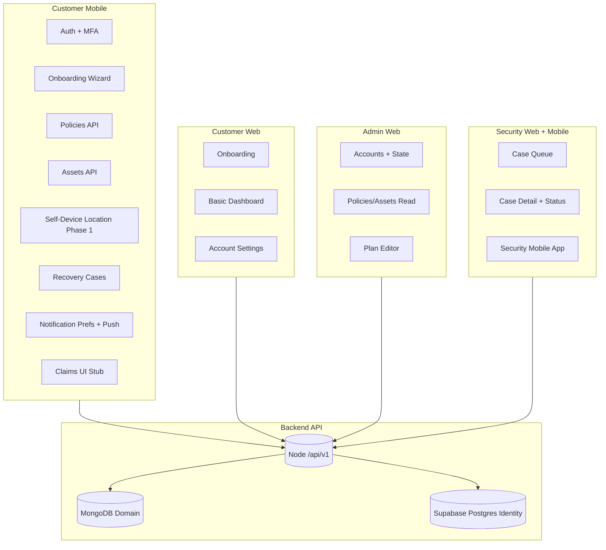

# 01 — Current Application Audit

**Verified:** 2026-08-14 against repository code (not HANDOFF claims alone)

---

## 1. Current application audit

### 1.1 Customer mobile (Expo SDK 57)

| Area | State | Key paths |
|------|-------|-----------|
| Navigation | Expo Router with role-based shells | `mobile/app/_layout.tsx`, `useAppShellGate.ts` |
| Auth | Full flow: welcome → signup → verify → login → MFA | `mobile/app/(auth)/*` |
| Onboarding | Pre-auth marketing + post-login wizard | `CustomerOnboardingScreen.tsx`, `(onboarding)/` |
| Customer tabs | Home · Policy · Assets · Profile | `(app)/_layout.tsx` |
| Home | **Placeholder** — email greeting + link cards | `(app)/index.tsx` |
| Policies | Live API CRUD | `src/screens/policy/*` |
| Assets | Live API CRUD | `src/screens/assets/*` |
| Self-device location | Phase 1 built — foreground only, smartphone | `src/location/*`, `device-locations/` |
| Maps | **Placeholder only** — no react-native-maps | `MapPlaceholder.tsx` |
| Report theft | Live recovery case creation | `report-theft/*` |
| Live tracking | Recovery cases list + polled location | `live-tracking/*` |
| Claims | UI scaffold — **backend 404** | `claims/*`, `api/claims.ts` |
| Notifications | Live preferences + push | `NotificationPreferencesScreen.tsx` |
| Security operator app | Separate shell — case queue | `(security-app)/*` |
| Tests | 75 passing / 19 suites | `mobile/` |

### 1.2 Customer web

| Area | State | Key paths |
|------|-------|-----------|
| Onboarding wizard | Live | `CustomerOnboardingPage.tsx` |
| Dashboard | Basic — policy/asset counts | `CustomerDashboardPage.tsx` |
| Account settings | Email, MFA, status | `CustomerAccountSettingsPage.tsx` |
| Notifications | Live preferences | `CustomerNotificationPreferencesPage.tsx` |
| Location / map | **Not built** | — |
| Recovery / claims | **Not built** | — |

### 1.3 Admin dashboard (`/admin/*`)

| Area | State |
|------|-------|
| Accounts | List + detail + suspend/reactivate |
| Policies / assets | Read-only audit views |
| Plans | Catalog editor |
| Payments / claims / devices | **Not built** |

### 1.4 Security dashboard (`/security/*`)

| Area | State |
|------|-------|
| Case queue | Live list + pagination |
| Case detail | Status updates, claim, customer/asset refs |
| Live ops map | **Not built** |
| Location for operators | **Not exposed** (backend gap) |
| KPI strip | **Not built** |

### 1.5 Backend (`/api/v1`)

| Domain | Routes | Notes |
|--------|--------|-------|
| Auth / session / MFA | ✅ | Supabase + device binding |
| Policies / assets | ✅ | Feature 004 |
| Asset location (self-device) | ✅ | `lastLocation` on asset doc only |
| Recovery cases | ✅ | Customer + security partner |
| Notifications | ✅ | Push + preferences |
| Plans catalog | ✅ | Public + authenticated |
| Admin read APIs | ✅ | Accounts, policies, assets, plans |
| Claims | ❌ | No routes |
| Payments | ❌ | Internal activate hook only |
| Profile / KYC / documents | ❌ | Account email only |
| Hardware GPS ingestion | ❌ | `gpsDeviceId` always null |
| Location history / trips | ❌ | No time-series store |
| Geofencing | ❌ | Docs only |
| Alert events API | ❌ | Notifications are preference/delivery only |

### 1.6 Design system

| Surface | Tokens | Components |
|---------|--------|------------|
| Web | `src/index.css`, `tailwind.config.js` | `src/components/*` (Button, Card, Badge, StatBlock, GlassCard, AssetBadge, …) |
| Mobile | `mobile/src/theme/tokens.ts` (bridge) | `mobile/src/theme/primitives/*` |
| Brand | Navy `#2C3E50`, Blue `#2780B8`, Gold `#F5A022` | Fraunces + Public Sans (web) |

---

## 2. Existing functionality map

**Solid lines = live today · Dashed concept = stub or missing**

| User journey | Works end-to-end? | Gap |
|--------------|-------------------|-----|
| Register → verify → plan → asset | ✅ Mobile + web | Payment skipped (honest) |
| View protection status at a glance | ❌ | Home is link cards, not command centre |
| Track smartphone (this device) | ⚠️ Partial | Last-known only; placeholder map |
| Track laptop/vehicle | ❌ | Needs hardware GPS vendor |
| See all assets on one map | ⚠️ Partial | Summary API exists; no real map |
| Report stolen → recovery case | ✅ | Location on case rarely populated |
| Security operator recovery ops | ⚠️ Partial | Queue yes; map/KPIs/location no |
| File insurance claim | ❌ | No backend |
| Complete profile / KYC | ❌ | Email + MFA only |
| Device activation / install guide | ❌ | No hardware vendor |
| Trip history / geofences | ❌ | No backend |

---

## 3. Gap summary (design must address)

1. **Customer home** does not answer the seven protection questions (see 05-customer-home-dashboard.md).
2. **No capability model** in UI — screens cannot yet hide battery/speed/geofence per device.
3. **No profile completion** beyond email verification.
4. **No alert centre** — notifications exist but no unified in-app feed with severity.
5. **Security dashboard** is a table, not an operations centre.
6. **Maps** are placeholders everywhere — need real map component with honest "last known" labelling.
7. **Asset vault** is a functional list, not a premium protection view.

---

## 4. What we will NOT destroy

- Auth, session refresh, device binding, MFA
- Feature 004 policies/assets API contracts
- Recovery case creation and security partner queue
- Notification preference system
- Admin audit read paths
- Self-device location Phase 1 (extend, don't replace)
- Error mapping (`mapUserFacingError`)
- Onboarding wizard (refine entry/exit, don't rewrite signup backend)
