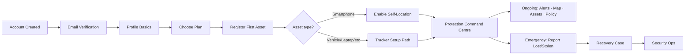

# 03 — Customer UX Architecture

**Agent 2 — Customer UX Architect**

---

## 1. Customer journey (post-registration)



**Principle:** Each step has one primary action. Complexity lives in detail screens, not the home path.

---

## 2. Customer navigation architecture (mobile)

### Proposed tab bar (5 tabs)

| Tab | Icon | Purpose |
|-----|------|---------|
| **Home** | Shield | Protection command centre |
| **Assets** | Grid | Digital asset vault |
| **Map** | MapPin | Live protection map (full screen) |
| **Alerts** | Bell | Alert centre + notifications entry |
| **Account** | User | Profile, settings, policy, support |

**Moved out of tabs (stack routes):**
- Policy detail (from Home or Account)
- Report lost/stolen (prominent FAB or Home quick action)
- Recovery case detail
- Claims (when built)
- MFA / notification prefs (from Account)

### Stack map

```
(app)/
├── index.tsx                    → Home (redesign)
├── assets/*                     → Vault (redesign)
├── map/                         → Full protection map (NEW)
├── alerts/                      → Alert centre (NEW)
├── account/                     → Profile hub (NEW, replaces flat profile.tsx)
├── policy/*
├── assets/[id]                  → Asset command view (redesign)
├── device-locations/            → Merge into map/ or keep as deep link
├── report-theft/*
├── live-tracking/*
├── claims/*
└── settings/*                   → Nested from account
```

---

## 3. Customer navigation (web)

Keep `/dashboard` as protection home (mirror mobile information hierarchy). Add:

- `/dashboard/map` — when customer web map ships (Phase 2)
- `/dashboard/alerts`
- `/dashboard/profile` — completion + verification
- `/dashboard/recovery/:caseId`

---

## 4. Flow specifications

### 4.1 Profile completion (Phase 2)

**Trigger:** Home `ProfileCompletionCard` when < 100%

Steps (configurable JSON schema — not all fields required Day 1):

1. Personal (name, phone, DOB optional)
2. Address (residential)
3. Emergency contact (optional)
4. Identity verification (when KYC backend exists)
5. Documents (when upload API exists)

**Status:** REQUIRES BACKEND for persistence beyond `account/me` today.

### 4.2 Identity verification centre (Phase 2–3)

States: `NOT_STARTED` | `IN_PROGRESS` | `PENDING_REVIEW` | `VERIFIED` | `REJECTED` | `ACTION_REQUIRED`

UI shows customer-safe rejection reasons only.

**Status:** REQUIRES BACKEND + REQUIRES CLIENT DECISION (POPIA)

### 4.3 Asset registration (redesign)

| Step | Content | Status |
|------|---------|--------|
| 1 | Asset type picker | SUPPORTED NOW |
| 2 | Type-specific fields | SUPPORTED NOW (`assetFormConfig`) |
| 3 | Photos | FUTURE — MP-5 deferred; design slots, no camera until destination exists |
| 4 | Documents | REQUIRES BACKEND |
| 5 | Tracking device | REQUIRES HARDWARE (vehicle/laptop) or self-device (phone) |
| 6 | Insurance link to policy | SUPPORTED NOW |
| 7 | Review + submit | SUPPORTED NOW |

**Vehicle onboarding** — specialized step 2 with make/model/VIN/reg + tracker question (YES / NO / NOT SURE). Tracker YES → activation flow when vendor exists.

### 4.4 Device activation (Phase 4)

Scan/enter device ID → connecting states → capability discovery → success.

UI states driven by `DeviceCapability` response — never hard-code battery if API returns null.

### 4.5 Lost / stolen (enhance existing)

1. Select asset
2. Lost vs stolen
3. When / last seen (optional text)
4. Confirm warning
5. Case reference + push to security

**Status:** MUST HAVE — mostly SUPPORTED NOW; polish UX + timeline on case detail.

### 4.6 Recovery (customer view)

Show: status, asset, last known location (honest label), case ref, assigned team name (if safe).

Hide: operator notes, partner tactical details.

---

## 5. Empty / loading / error / offline / permission states

| State | Home behaviour |
|-------|----------------|
| New customer, no assets | Hero: "Protect your first asset" + CTA |
| No tracker | "Asset protected — connect tracking" per asset type |
| Location permission denied | Banner + link to settings; map shows "Location unavailable" |
| Offline | Cached last-known + offline banner (existing NetworkProvider) |
| API error | `mapUserFacingError` + retry |
| Claims unavailable | Keep honest banner (existing pattern) |

---

## 6. Accessibility requirements

- All status indicators: **icon + text**, not color alone
- Map markers: accessibility labels with asset name + status + last update
- Minimum 44pt touch targets (already in tokens)
- Screen reader order: greeting → health → alerts → assets → map → actions
- Reduce motion: respect `prefers-reduced-motion` for health pulse animation

---

## 7. Responsive behaviour

- Mobile-first; web dashboard uses same data hooks, wider map + side panel for asset list
- Security dashboard: desktop-first map + dense table; tablet collapses queue below map
