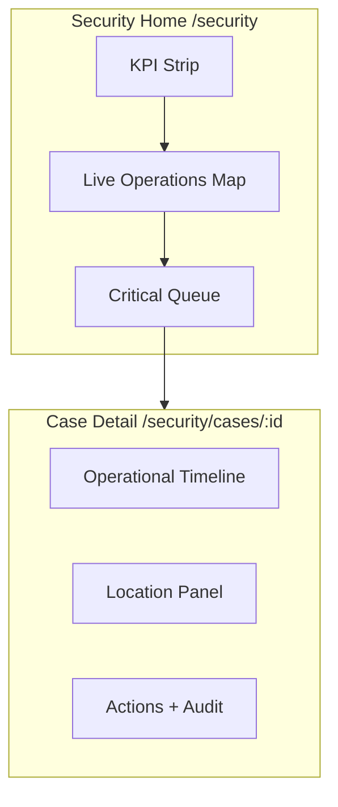

# 06 — Security / Recovery Operations Dashboard

**Separate from Admin — operational command centre**

---

## 1. Architecture



**Mobile security app** `(security-app)` mirrors queue + case detail; map remains primary on web desktop.

---

## 2. Security home wireframe (web)

```
┌──────────────────────────────────────────────────────────────┐
│ TD IT · Security Operations                    [Operator ▼]   │
├──────────┬──────────┬──────────┬──────────┬─────────────────┤
│ ACTIVE 8 │ CRIT 2   │ ONLINE 12│ OFFLINE 3│ ACTION REQ 4    │  KPI strip
├──────────────────────────────────────────────────────────────┤
│ LIVE OPERATIONS MAP                          [Filters ▼]    │
│ ┌────────────────────────────────────────────────────────┐   │
│ │  · incident pins  · last-known assets  · geofences   │   │
│ │                        (Phase 2 layers)               │   │
│ └────────────────────────────────────────────────────────┘   │
├────────────────────────────┬─────────────────────────────────┤
│ CRITICAL INCIDENTS         │ RECENT ACTIVITY                 │
│ #REC-234 STOLEN · CRITICAL │ 08:42 Location updated        │
│ Toyota · JHB · 18s ago     │ 08:36 Team Alpha assigned     │
│ [Open Case]                │ ...                             │
├────────────────────────────┴─────────────────────────────────┤
│ FULL QUEUE                                    [Load more]     │
│ DataTable: ref · type · asset · status · last update · assign │
└──────────────────────────────────────────────────────────────┘
```

---

## 3. KPI definitions

| KPI | Source | Status |
|-----|--------|--------|
| Active incidents | `GET /security/cases?status=active_*` | SUPPORTED NOW (aggregate client-side) |
| Critical | Cases with `theft` + unassigned or stale | DERIVED |
| Devices online | **REQUIRES BACKEND** hardware telemetry | Phase 4 |
| Recovered today | Cases `status=recovered` today | DERIVED |
| Action required | Unassigned + critical + overdue SLA | DERIVED |

Phase 1 KPIs use case API only — hide hardware KPIs until data exists.

---

## 4. Case detail (enhance existing)

Add to `SecurityCasePages.tsx`:

- **Operational timeline** (synthetic from case status transitions until event API)
- **Location panel** — `GET /recovery/cases/:id/location` or security-scoped endpoint (**REQUIRES BACKEND** — security route for partner location read + AUD-9)
- **Customer contact** — masked phone/email; reveal on action + audit
- **Assignment** — team field (when teams API exists)

### Timeline events (Phase 1 — from case record)

- Customer reported
- Incident created
- Operator claimed
- Status → investigating / tracking / recovered / closed
- Location updated (when populated)

---

## 5. Security actions & audit

| Action | Role | Audit |
|--------|------|-------|
| Claim case | Operator | Existing API |
| Update status | Operator | Existing + extend audit |
| Assign / reassign | Senior+ | REQUIRES BACKEND |
| Escalate | Senior+ | REQUIRES BACKEND |
| View full location | Operator | **AUD-9 required** |
| Contact customer | Operator | Log communication |
| Mark recovered | Operator | Existing |
| Close case | Manager+ | Existing |

### Role matrix (target)

| Capability | Operator | Senior | Recovery Mgr | Sec Admin |
|------------|----------|--------|--------------|-----------|
| View queue | ✅ | ✅ | ✅ | ✅ |
| Claim / update | ✅ | ✅ | ✅ | ✅ |
| View location | ✅* | ✅* | ✅* | ✅* |
| Reassign | ❌ | ✅ | ✅ | ✅ |
| Close case | ❌ | ❌ | ✅ | ✅ |
| User admin | ❌ | ❌ | ❌ | ✅ |

*With purpose reference + audit trail (ADR-0006)

**Today:** single `security_company_operator` type — implement UI hooks for future RBAC.

---

## 6. Security alerts (operator)

Feed from same eventual alerts bus. Phase 1: poll case list for critical/unassigned.

Examples: new stolen report, case overdue, device offline during recovery (**hardware**).

---

## 7. Admin vs security separation

| Admin `/admin` | Security `/security` |
|--------------|----------------------|
| Accounts, plans, billing | Incidents, map, recovery |
| Read-only asset/policy audit | Operational case workflow |
| Suspend account | Cannot change plan/pricing |

Do not merge nav trees.

---

## 8. Mobile security app alignment

| Screen | Change |
|--------|--------|
| Cases list | Add severity badges + last update |
| Case detail | Timeline + location (when API) |
| Tracking | Real map when coordinates exist |

**MUST HAVE** Phase 8 (after customer home + location read for partners)
